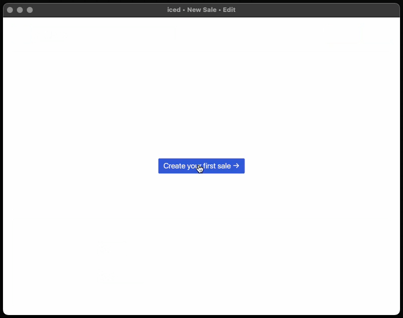

<div align="center">

# iced_receipts

A multi-screen desktop application built with
[iced](https://github.com/iced-rs/iced) demonstrating some neat patterns for
state management, screen transitions, and form handling.

[](https://github.com/iced-rs/iced)



</div>

## Overview

This example showcases a few useful patterns for building desktop applications with `iced`:

- Screens sharing single simple straightforward state, as said by someone struck
  with some alliteration spell
- A clean and flexible `Action` API for handling screen events and instructions
- Form handling with keyboard navigation (Tab and Escape)

## Project Structure

```
src/
├── main.rs        # App entry point and top level state management
├── list.rs        # Simple sales list screen
├── sale.rs        # Edit/view mode screens example
│   ├── edit.rs    # Edit screen for creating and updating sales
│   └── show.rs    # Read-only mode for sales
└── action.rs      # Action API for handling instructions
```

## Action API

The example uses a `Action` type providing a unified way to handle both
instructions and tasks across screens, where instructions are in-app actions
directly by your application while tasks are handled by the `iced` runtime.

```rust
pub struct Action<Instruction, Message> {
    pub instruction: Option<Instruction>,
    pub task: Task<Message>,
}
```

One advantage of this approach is that it easily allows the user to compose
an instruction that combines an instruction and a task, whereas if we used an
`enum` we would need to have a variant for instructions, a variant for tasks, and
a variant for combining them. This is useful, for instance, for minor UI-related
tasks such as focusing a specific input field after an instruction is handled by
your app.

Currently, this sample app only contains one such example: when the user clicks
on "Edit" in the sale "show" mode, the app needs to switch the screen to the
"edit" mode and focus the first input field, so we do that by processing the
`Message::StartEdit` action as follows:

```rust
// sale.rs
pub fn update(sale: &mut Sale, message: Message) -> Action {
    match message {
        Message::Show(msg) => match msg {
            // ...
            show::Message::StartEdit => {
                Action::instruction(Instruction::StartEdit).with_task(focus_next())
            }
        },
    }
}
```

The main `App::update` function handles `Message`s by delegating them to the
screens, which return an `Action` from their own `update` functions. So the 
app then handles any instructions and tasks contained in that action. Since
instructions can also return tasks, the app chains those returned tasks with the
original task from the action.

```rust
// app.rs
impl App { 
    fn update(&mut self, message: Message) -> Task<Message> {
        match message {
            Message::Sale(sale_id, msg) => {
                let sale = /* get sale by id */;
                let action = sale::update(sale, msg)
                    .map_instruction(move |o| Instruction::Sale(sale_id, o))
                    .map(move |m| Message::Sale(sale_id, m));

                // handle instruction returning either a useful task or a dummy
                // noop Task::none()
                let instruction_task = if let Some(instruction) = action.instruction {
                    self.perform(instruction)
                } else {
                    Task::none()
                };

                // chain the task returned by the instruction with the task
                // from the action
                return instruction_task.chain(action.task);
            }

            // ...other variants...
        }
    }
}
```

Though this may seem like a lot of boilerplate, it composes nicely across the
entire application and allows for a clean and flexible way to handle instructions
from child components and any tasks they may want to perform.

More information about the `Action` type can be found in the
[action.rs](src/action.rs) file.

## License

This project is licensed under the MIT License - see the [LICENSE](LICENSE) file
for details.

## Contributing

This is an example project meant for learning purposes. Feel free to use these
patterns in your own projects!